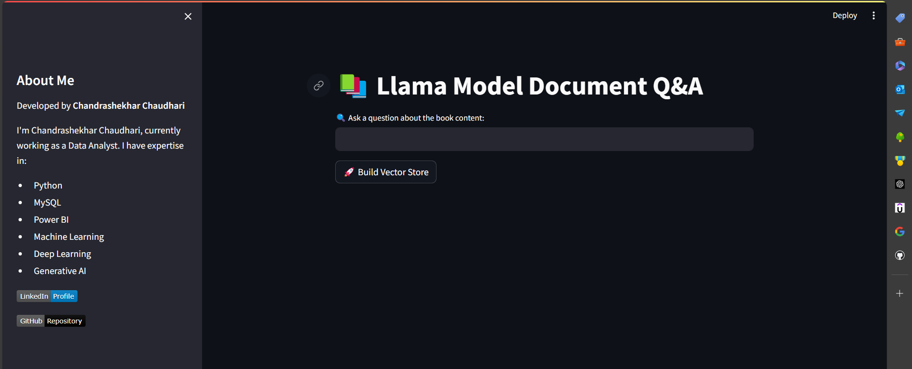

# 📚 Llama Model Document Q&A

This project is a Streamlit application that allows users to ask questions about the content of a book. The application uses the Llama Model for question-answering and Google Generative AI for vector embeddings.

## Features

- **Document Loader**: Loads PDF documents from the `./Book` directory.
- **Text Splitter**: Splits documents into chunks for better processing.
- **Vector Embedding**: Creates vector embeddings using Google Generative AI.
- **Vector Store**: Builds a vector store using FAISS for efficient retrieval.
- **Question-Answering**: Uses the Llama Model to answer questions based on the provided document content.

## Installation

1. Clone the repository:
    ```sh
    git clone https://github.com/Chandrashekhar569/llama-model-qa.git
    cd llama-model-qa
    ```

2. Install the required packages:
    ```sh
    pip install -r requirements.txt
    ```

3. Set up your environment variables:
    - Create a `.env` file in the project root.
    - Add your API keys in the `.env` file:
      ```
      GROQ_API_KEY=your_groq_api_key
      GOOGLE_API_KEY=your_google_api_key
      ```

## Usage

1. Run the Streamlit application:
    ```sh
    streamlit run app.py
    ```

2. Open the provided URL in your web browser.

3. Use the interface to load documents, build the vector store, and ask questions about the book content.

## How It Works

- **Loading Environment Variables**: Efficiently loads environment variables using `dotenv`.
- **Initializing LLM**: Initializes the Llama Model with the provided API key.
- **Vector Embedding**: Creates vector embeddings for document chunks.
- **Retrieval Chain**: Combines document retrieval with the Llama Model for accurate Q&A.

## Screenshots



## Author

Chandrashekhar Chaudhari

- **LinkedIn**: [Chandrashekhar](https://www.linkedin.com/in/chandrashekhar1997/)
- **GitHub**: [Chandrashekhar569](https://github.com/Chandrashekhar569)

## License

This project is licensed under the MIT License. See the [LICENSE](LICENSE) file for details.
